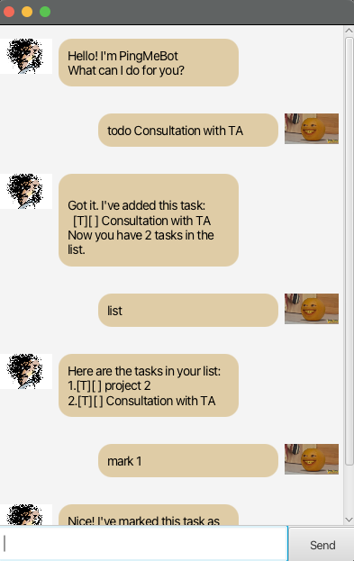

# PingMeBot User Guide



PingMeBot is a friendly chat bot which can manage all 
the tasks that you have. It is characterised by its 
usage of the Command Line Interface (CLI) and it can
help you keep track of all your tasks faster than 
traditional GUI applications :)

## Adding todos: `todo`

This command adds a todo task into the list of tasks.

> Format: `todo <task description>`

Example: `todo borrow book`

```
Got it. I've added this task:
  [T][ ] borrow book
Now you have X tasks in the list.
```

where X is the current total number of tasks in your task list.

## Adding Deadlines: `deadline`

This command adds a deadline task into the list of tasks.

> Format: `deadline <task description> /by <LocalDateTime>`
> **Note that the finish by timing has to be in the DD-MM-YYYY HHmm format**

Example: `deadline borrow book /by 05/05/2023 1800`

```
Got it. I've added this task:
  [D][ ] borrow book (by: May 05 2023, 1800)
Now you have X tasks in the list.
```

where X is the current total number of tasks in your task list.


## Adding Events: `event`

This command adds an events task into the list of tasks.

> Format: `event <task description> /from <start time> /to <end time>`

Example: `event borrow book /from 1800 /to 1900`

```
Got it. I've added this task:
  [E][ ] borrow book (from: 1800, to: 1900)
Now you have X tasks in the list.
```

where X is the current total number of tasks in your task list

## Saving your task: `bye`

This command will save all your tasks internally in a file. Bot will say bye to you.

> Format: `bye`

Example: `bye`

```
Bye. Hope to see you again soon!
```


## Viewing all tasks: `list`

This command lists out all the current tasks in your list of tasks.

> Format: `list`

Example: `list`

```
Here are the tasks in your list:

1.[T][ ] Consultation with TA

2.[T][ ] borrow book

3.[E][ ] borrow book (from: 1800, to: 1900)
```

## Finding tasks by keyword: `find`

This command allows you find a matching task according to the keyword
that you query with.

> Format: `find <task description>`
> **Note that the keyword to find is case-sensitive**

Example: `list Consultation`

```
Here are the matching tasks in your list:
1.[T][ ] Consultation with TA
```

## Marking task as completed: `mark`

This command allows you to mark task as completed.

> Format: `mark <task number>`
Example: `mark 1`

```
Nice! I've marked this task as done:
  [T][X] Consultation with TA
```

## Unmarking task as uncompleted: `unmark`

This command allows you to unmark task as not completed.

> Format: `unmark <task number>`

Example: `unmark 1`

```
Nice! I've marked this task as done:
  [T][ ] Consultation with TA
```


## Deleting a task : `delete`

This command allows you to delete a task from your list of tasks.

> Format: `delete <task number>`

Example: `delete 1`

```
Noted. I've removed this task:
  [T][ ] Consultation with TA
Now you have X tasks in the list.
```
where X is the remaining number of tasks in your list of tasks.

## Postponing a task: `postpone`

This command allows you to postpone **ONLY** deadline and events tasks.

> Format for postponing deadline task: `postpone <task number> /by <LocalDateTime>`
> **Note that the finish by timing has to be in the DD-MM-YYYY HHmm format**

Example: `postpone 1 /by 05/05/2024 1800`

```
Got it. I've postponed this task to:
  [D][ ] project (by: May 05 2024, 1800)
```

> Format for postponing event task: `postpone <task number> /from <new start time> /to <new end time>`

Example: `postpone 1 /from 1900 /to 2000`

```
Got it. I've postponed this task to:
  [E][ ] read book (from: 1900, to: 2000)
```
